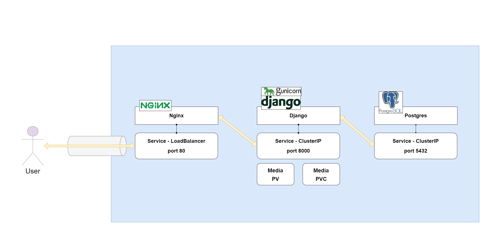
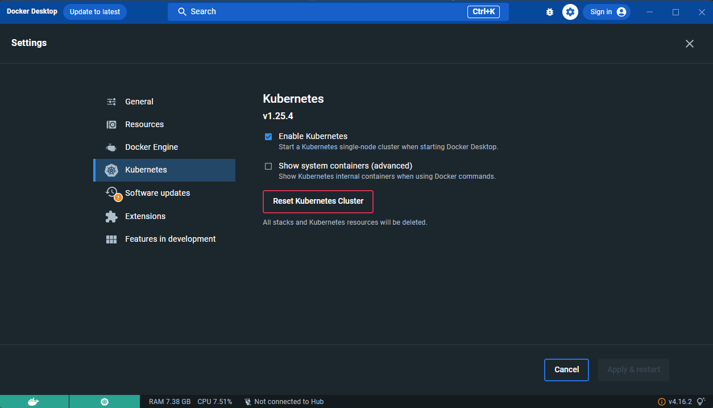
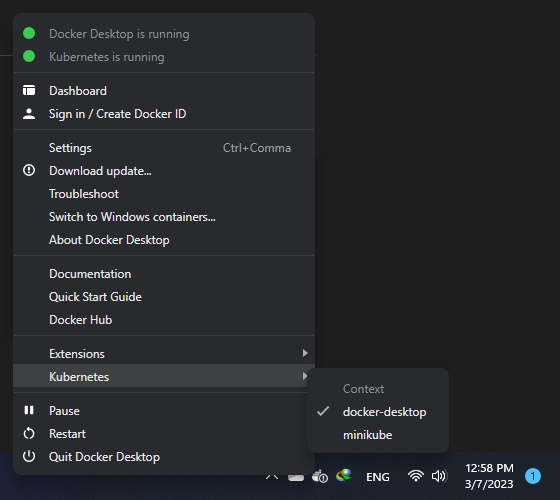

<h1 align="center">Django Kubernetes Template</h1>
<h3 align="center">A brief example of how to deploy django with kubernetes</h3>
<p align="center">
<a href="https://www.python.org" target="_blank">  </a>
<a href="https://www.djangoproject.com/" target="_blank">  </a> 
<a href="https://www.postgresql.org" target="_blank">  </a>
<a href="https://www.nginx.com" target="_blank">  </a>
<a href="https://git-scm.com/" target="_blank">  </a>
<a href="https://www.docker.com/" target="_blank">  </a>
<a href="https://kubernetes.io/" target="_blank">  </a>
</p>

    
# Guideline
- [Guideline](#guideline)
- [Goal](#goal)
- [Diagram](#diagram)
- [Setup Development Environment](#setup-development-environment)
  - [Docker Installation](#docker-installation)
  - [Kubernetes Cluster Setup](#kubernetes-cluster-setup)
    - [Docker Desktop (default)](#docker-desktop-default)
    - [Minikube Installation (Optional)](#minikube-installation-optional)
  - [KubeCTL Installation](#kubectl-installation)
  - [Test Kubectl connection to cluster](#test-kubectl-connection-to-cluster)
  - [Switch Cluster](#switch-cluster)
- [CheatSheets](#cheatsheets)
- [Deployment](#deployment)
  - [Build docker image](#build-docker-image)
  - [Deploy with Kubectl](#deploy-with-kubectl)
    - [deploy postgres](#deploy-postgres)
    - [deploy redis](#deploy-redis)
    - [deploy django](#deploy-django)
    - [deploy nginx](#deploy-nginx)
    - [deploy worker](#deploy-worker)
    - [deploy beater](#deploy-beater)
- [License](#license)
- [Bugs](#bugs)

# Goal
This template is dedicated to up and running django with kubernetes.

# Diagram 
this is a simple diagram to show you how the services are integrating with each other.
<div align="center" ></div>

# Setup Development Environment
in order to work with your django application with k8s you need to prepare your environment for development, such as installing docker and minikube for start. so follow along the instructions and make everything.

## Docker Installation
You'll need to have [Docker installed](https://docs.docker.com/get-docker/).
It's available on Windows, macOS and most distros of Linux. 

System requirements
To install Docker Desktop successfully, your Linux host must meet the following general requirements:

- 64-bit kernel and CPU support for virtualization.
- KVM virtualization support. Follow the KVM virtualization support instructions to check if the KVM kernel modules are enabled and how to provide access to the kvm device.
- QEMU must be version 5.2 or newer. We recommend upgrading to the latest version.
- systemd init system.
- Gnome, KDE, or MATE Desktop environment.
- For many Linux distros, the Gnome environment does not support tray icons. To add support for tray icons, you need to install a Gnome extension. For example, AppIndicator.
- At least 4 GB of RAM.
- Enable configuring ID mapping in user namespaces, see File sharing.

Docker Desktop for Linux runs a Virtual Machine (VM). For more information on why, see Why Docker Desktop for Linux runs a VM.

If you're using Windows, it will be expected that you have to install wsl too. [WSL or WSL
2](https://nickjanetakis.com/blog/a-linux-dev-environment-on-windows-with-wsl-2-docker-desktop-and-more).

That's because we're going to be running shell commands. You can always modify
these commands for PowerShell if you want.


## Kubernetes Cluster Setup
in order to run the kubernetes cluster you need to install one of the following providers for dev environment
### Docker Desktop (default)
docker desktop already has support for windows,linux and mac so its already there all you have to do is to go to docker desktop settings and enable kubernetes, and wait till installation is completed. after that you will see another icon appears beside docker and shows the status of the kubernetes too.
<div align="center" ></div>


### Minikube Installation (Optional)
Minikube is Kubernetes tool. It allows you to run Kubernetes locally on your computer. It runs as a single-node Kubernetes cluster within your local computer, making it easy to develop the Kubernetes app.
you can follow the instructions provided here to install it based on your os.

<https://minikube.sigs.k8s.io/docs/start/>

What you’ll need
- 2 CPUs or more
- 2GB of free memory
- 20GB of free disk space
- Internet connection
- Container or virtual machine manager, such as: Docker, QEMU, Hyperkit, Hyper-V, KVM, Parallels, Podman, VirtualBox, or VMware Fusion/Workstation


after installation you have to run the minikube and set it up for usage, so in order to do that just run the following command:
```shell
minikube start
```
<div align="center" ></div>
**Note:** if you want to change the default driver for minikube you can pass the argument like this:
```shell
minikube start --driver=virtualbox
```
which will setup minikube with virtualbox as the default driver. for more information see the documentation in here: <https://minikube.sigs.k8s.io/docs/drivers/>. by default we will use docker.

when its done you will see the details of the steps and informations.
<div align="center" ></div>


## KubeCTL Installation
The Kubernetes command-line tool, kubectl, allows you to run commands against Kubernetes clusters. You can use kubectl to deploy applications, inspect and manage cluster resources, and view logs. For more information including a complete list of kubectl operations, see the kubectl reference documentation provided here:

<https://kubernetes.io/docs/reference/kubectl/>

for installing kubectl, you can head to the link down below and choose the right os and start the installation steps:

<https://kubernetes.io/docs/tasks/tools/>

**Note:** for windows users after downloading the file you have to put it in a folder inside C directory and then just add the path to environment variables of the system. then you can access and test it with the following command: ```shell  kubectl version --client```


## Test Kubectl connection to cluster

Once you have the PATH ready, run the following command to check if your set Kubectl is ready to execute Kubernetes commands:
```shell 
kubectl cluster-info
```
and you should see something similar to this:
<div align="center" ></div>


## Switch Cluster
if you have already setup more than one cluster you can switch between them by docker icon in system tray and changed the kubernetes cluster from one to another.
<div align="center" ></div>


# CheatSheets
kubernetes cheat sheets.

<div align="center" ></div>

# Deployment

## Build docker image
for deployment purposes you need to build the docker image, so it can be used inside the k8s deployment as a refrence.
there are two options here: 

- build locally and push to docker hub
- build locally and use it

the correct way is to build and push to docker hub but as we may be some restrictions just build and use it.
remember that we are using a special naming so follow the commands below to create the images.
after that you can either decide to push it to hub or not.

for building django app:
```shell
docker build -t django_app -f ./dockerfiles/prod/django/Dockerfile .
```

and for nginx app:
```shell
docker build -t nginx_app -f ./dockerfiles/prod/nginx/Dockerfile .
```
if you want to push it to the hub firstly, login to docker with the following command:
```shell
docker login -u username -p password
```

after that just push your apps with the following command:
```shell
docker push [USERNAME]/[IMAGE-NAME]:[TAG]
```

## Deploy with Kubectl
in order to deploy the sample project i have provided 3 services inside the ```k8s``` directory:

- postgres
- redis
- django
- nginx
- celery-worker
- celery-beater
- flower

in order to deploy the application using the local cluster you need to apply or create them by kubectl, which will communicate with the cluster and create the needed pods,services,deployments and etc. so just follow the instructions:


### deploy postgres
for setting up postgres first of all you need to setup the config-map first so:
```shell
kubectl apply -f ./k8s/postgres/config-map.yml
```

after that you need to deploy the pod by the deployment:
```shell
kubectl apply -f ./k8s/postgres/deployment.yml
```

and lastly i norder for your services to access the database you need to assign a service to it by:
```shell
kubectl apply -f ./k8s/postgres/service.yml
```
at the end you will end up having the postgres up and running.
if you list all the details you can see that the database is running at this point.


### deploy redis
first you need to deploy the pod by the deployment:
```shell
kubectl apply -f ./k8s/redis/deployment.yml
```

and lastly i norder for your services to access the database you need to assign a service to it by:
```shell
kubectl apply -f ./k8s/redis/service.yml
```


### deploy django
our main service is our django application which will be communicating with the database. os first of all lets setup config-map
```shell
kubectl apply -f ./k8s/django/config-map.yml
```

after that you need to deploy the pod by the deployment:
```shell
kubectl apply -f ./k8s/django/deployment.yml
```

and lastly to make the service accessible by nginx we need to have a service to be able to connect to:
```shell
kubectl apply -f ./k8s/django/service.yml
```
at the end you will end up having the django app up and running.
if you list all the details you can see that the django app and database is running at this point.
you can change the default configs and update each one.

migrate database configs.
```shell
kubectl exec POD_NAME -- python manage.py migrate
```

**Note:** you need to have migrations included in your project and just do the migrate.


### deploy nginx
first you need to deploy the pod by the deployment, nginx will be running with 2 replicas:
```shell
kubectl apply -f ./k8s/nginx/deployment.yml
```

and also apply the service so we can access the django app though nginx,which will be in load balance mode:
```shell
kubectl apply -f ./k8s/nginx/service.yml
```
at the end you will end up having the all the needed services to run the whole application.

```shell
C:\Users\AliBigdeli\Documents\GitHub\Django-Kubernetes-Template>kubectl get all
NAME                           READY   STATUS    RESTARTS   AGE
pod/django-5b74bd444-mskdm     1/1     Running   0          2m43s
pod/my-nginx-c7bb68546-64q56   1/1     Running   0          25s
pod/my-nginx-c7bb68546-qrkl2   1/1     Running   0          25s
pod/postgres-6bdb7d69c-2wn9v   1/1     Running   0          7m3s
pod/redis-67b95b7577-2jwv8     1/1     Running   0          4m1s

NAME                         TYPE           CLUSTER-IP       EXTERNAL-IP   PORT(S)        AGE
service/django               ClusterIP      10.110.233.36    <none>        8000/TCP       2m21s
service/kubernetes           ClusterIP      10.96.0.1        <none>        443/TCP        4d21h
service/nginx-loadbalancer   LoadBalancer   10.109.224.172   localhost     80:30362/TCP   20s
service/postgres             ClusterIP      10.97.134.246    <none>        5432/TCP       6m58s
service/redis                ClusterIP      10.98.178.118    <none>        6379/TCP       3m46s

NAME                       READY   UP-TO-DATE   AVAILABLE   AGE
deployment.apps/django     1/1     1            1           2m43s
deployment.apps/my-nginx   2/2     2            2           25s
deployment.apps/postgres   1/1     1            1           7m3s
deployment.apps/redis      1/1     1            1           4m1s

NAME                                 DESIRED   CURRENT   READY   AGE
replicaset.apps/django-5b74bd444     1         1         1       2m43s
replicaset.apps/my-nginx-c7bb68546   2         2         2       25s
replicaset.apps/postgres-6bdb7d69c   1         1         1       7m3s
replicaset.apps/redis-67b95b7577     1         1         1       4m1s
```
at the end you need to be able to see the website by opening your localhost on port 80


### deploy worker
in order to control celery worker we need to deploy the worker also based on the django config, so with the following command you can deploy the worker.
```shell
kubectl apply -f ./k8s/celery-worker/deployment.yml
```
**Note:** there is no need for other configurations except changing the resources based on your need.


### deploy beater
for your schedule tasks you need to have a beater running to follow the time and do tasks based on schedules, in order to run it you can use the following command:
```shell
kubectl apply -f ./k8s/celery-beater/deployment.yml
```
**Note:** there is no need for other configurations except changing the resources based on your need.

and at the end you need should have all the pods running like the list below:
```shell
C:\Users\AliBigdeli\Documents\GitHub\Django-Kubernetes-Template>kubectl get all
NAME                                 READY   STATUS    RESTARTS   AGE
pod/celery-beater-c85b98476-7mr8r    1/1     Running   0          74m
pod/celery-worker-76455b99fb-knhtn   1/1     Running   0          81m
pod/django-5b74bd444-r6nhl           1/1     Running   0          82m
pod/my-nginx-c7bb68546-m7c8t         1/1     Running   0          81m
pod/my-nginx-c7bb68546-vtcdl         1/1     Running   0          81m
pod/postgres-6bdb7d69c-2wn9v         1/1     Running   0          107m
pod/redis-67b95b7577-2jwv8           1/1     Running   0          104m

NAME                         TYPE           CLUSTER-IP       EXTERNAL-IP   PORT(S)        AGE
service/django               ClusterIP      10.110.233.36    <none>        8000/TCP       103m
service/kubernetes           ClusterIP      10.96.0.1        <none>        443/TCP        4d22h
service/nginx-loadbalancer   LoadBalancer   10.109.224.172   localhost     80:30362/TCP   101m
service/postgres             ClusterIP      10.97.134.246    <none>        5432/TCP       107m
service/redis                ClusterIP      10.98.178.118    <none>        6379/TCP       104m

NAME                            READY   UP-TO-DATE   AVAILABLE   AGE
deployment.apps/celery-beater   1/1     1            1           80m
deployment.apps/celery-worker   1/1     1            1           81m
deployment.apps/django          1/1     1            1           82m
deployment.apps/my-nginx        2/2     2            2           81m
deployment.apps/postgres        1/1     1            1           107m
deployment.apps/redis           1/1     1            1           104m

NAME                                       DESIRED   CURRENT   READY   AGE
replicaset.apps/celery-beater-c85b98476    1         1         1       74m
replicaset.apps/celery-worker-76455b99fb   1         1         1       81m
replicaset.apps/django-5b74bd444           1         1         1       82m
replicaset.apps/my-nginx-c7bb68546         2         2         2       81m
replicaset.apps/postgres-6bdb7d69c         1         1         1       107m
replicaset.apps/redis-67b95b7577           1         1         1       104m
```

# License
MIT.


# Bugs
Feel free to let me know if something needs to be fixed. or even any features seems to be needed in this repo.
