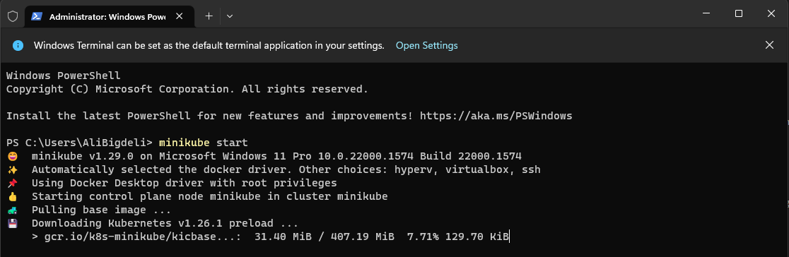
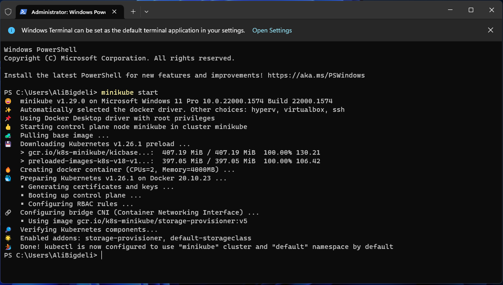
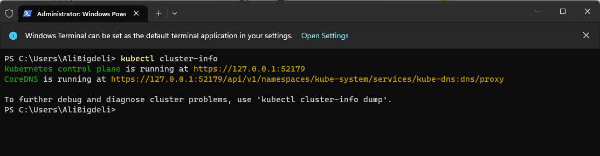
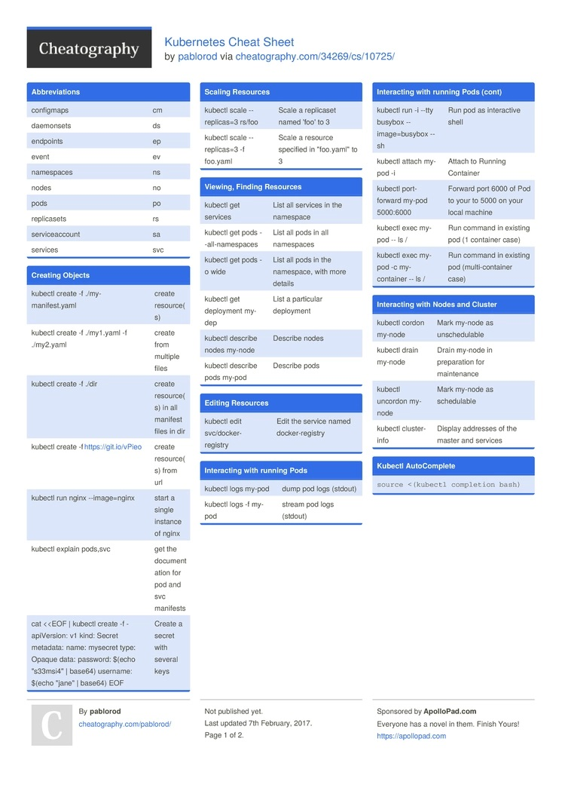

<h1 align="center">Django Kubernetes Template</h1>
<h3 align="center">A brief example fo how to deploy django in kubernetes</h3>
<p align="center">
<a href="https://www.python.org" target="_blank">  </a>
<a href="https://www.djangoproject.com/" target="_blank">  </a> 
<a href="https://www.postgresql.org" target="_blank">  </a>
<a href="https://www.nginx.com" target="_blank">  </a>
<a href="https://git-scm.com/" target="_blank">  </a>
<a href="https://www.docker.com/" target="_blank">  </a>
<a href="https://kubernetes.io/" target="_blank">  </a>
</p>

    
# Guideline
- [Guideline](#guideline)
- [Goal](#goal)
- [Setup Development Environment](#setup-development-environment)
  - [Docker Installation](#docker-installation)
  - [KubeCTL Installation](#kubectl-installation)
  - [Minikube Installation](#minikube-installation)
  - [Helm Installation](#helm-installation)
  - [Test Kubectl connection to cluster](#test-kubectl-connection-to-cluster)
- [CheatSheets](#cheatsheets)
  - [deploy with helm](#deploy-with-helm)

# Goal
This template id dedicated to up and running django with kubernetes.

# Setup Development Environment
in order to work with your django application with k8s you need to prepare your environment for development, such as installing docker and minikube for start. so follow along the instructions and make everything.

## Docker Installation
You'll need to have [Docker installed](https://docs.docker.com/get-docker/).
It's available on Windows, macOS and most distros of Linux. 

System requirements
To install Docker Desktop successfully, your Linux host must meet the following general requirements:

- 64-bit kernel and CPU support for virtualization.
- KVM virtualization support. Follow the KVM virtualization support instructions to check if the KVM kernel modules are enabled and how to provide access to the kvm device.
- QEMU must be version 5.2 or newer. We recommend upgrading to the latest version.
- systemd init system.
- Gnome, KDE, or MATE Desktop environment.
- For many Linux distros, the Gnome environment does not support tray icons. To add support for tray icons, you need to install a Gnome extension. For example, AppIndicator.
- At least 4 GB of RAM.
- Enable configuring ID mapping in user namespaces, see File sharing.

Docker Desktop for Linux runs a Virtual Machine (VM). For more information on why, see Why Docker Desktop for Linux runs a VM.

If you're using Windows, it will be expected that you have to install wsl too. [WSL or WSL
2](https://nickjanetakis.com/blog/a-linux-dev-environment-on-windows-with-wsl-2-docker-desktop-and-more).

That's because we're going to be running shell commands. You can always modify
these commands for PowerShell if you want.


## KubeCTL Installation
The Kubernetes command-line tool, kubectl, allows you to run commands against Kubernetes clusters. You can use kubectl to deploy applications, inspect and manage cluster resources, and view logs. For more information including a complete list of kubectl operations, see the kubectl reference documentation provided here:

<https://kubernetes.io/docs/reference/kubectl/>

for installing kubectl, you can head to the link down below and choose the right os and start the installation steps:

<https://kubernetes.io/docs/tasks/tools/>

**Note:** for windows users after downloading the file you have to put it in a folder inside C directory and then just add the path to environment variables of the system. then you can access and test it with the following command: ```shell  kubectl version --client```


## Minikube Installation
Minikube is Kubernetes tool. It allows you to run Kubernetes locally on your computer. It runs as a single-node Kubernetes cluster within your local computer, making it easy to develop the Kubernetes app.
you can follow the instructions provided here to install it based on your os.

<https://minikube.sigs.k8s.io/docs/start/>

What you’ll need
- 2 CPUs or more
- 2GB of free memory
- 20GB of free disk space
- Internet connection
- Container or virtual machine manager, such as: Docker, QEMU, Hyperkit, Hyper-V, KVM, Parallels, Podman, VirtualBox, or VMware Fusion/Workstation


after installation you have to run the minikube and set it up for usage, so in order to do that just run the following command:
```shell
minikube start
```
<div align="center" ></div>
**Note:** if you want to change the default driver for minikube you can pass the argument like this:
```shell
minikube start --driver=virtualbox
```
which will setup minikube with virtualbox as the default driver. for more information see the documentation in here: <https://minikube.sigs.k8s.io/docs/drivers/>. by default we will use docker.

when its done you will see the details of the steps and informations.
<div align="center" ></div>


## Helm Installation
Helm is a package manager for Kubernetes. It is the apt, yum, or homebrew equivalent for Kubernetes. The fundamental unit of Helm is a Helm chart. A set of Helm charts together form a packaged application that can be deployed as one unit. Helm serves two main functions:

- Package Manager: Helm works as a package manager with in-built version and dependencies management.
- Templating Engine: By creating application templates using Helm charts, DevOps personnel can deploy the same application across different Kubernetes clusters such as development, staging, and production with the same set of Kubernetes YAML files.

general installation:
<https://helm.sh/docs/intro/install/>

github link for installation installation:
<https://github.com/helm/helm/releases>


## Test Kubectl connection to cluster

Once you have the PATH ready, run the following command to check if your set Kubectl is ready to execute Kubernetes commands:
```shell 
kubectl cluster-info
```
and you should see something similar to this:
<div align="center" ></div>

# CheatSheets
kubernetes cheat sheets.

<div align="center" ></div>


## deploy with helm
```shell
helm create <APP_NAME>
```

```shell
helm upgrade --install <APP_NAME> ./helm/<APP_NAME>/
```

```shell
kubectl get pod
```


```shell
kubectl port-forward <POD_NAME> 8080:80
```


registry.hamdocker.ir
fiNg3eX4mWiWanLb


docker build -t django_app -f ./dockerfiles/prod/django/Dockerfile .
docker build -t nginx_app -f ./dockerfiles/prod/nginx/Dockerfile .